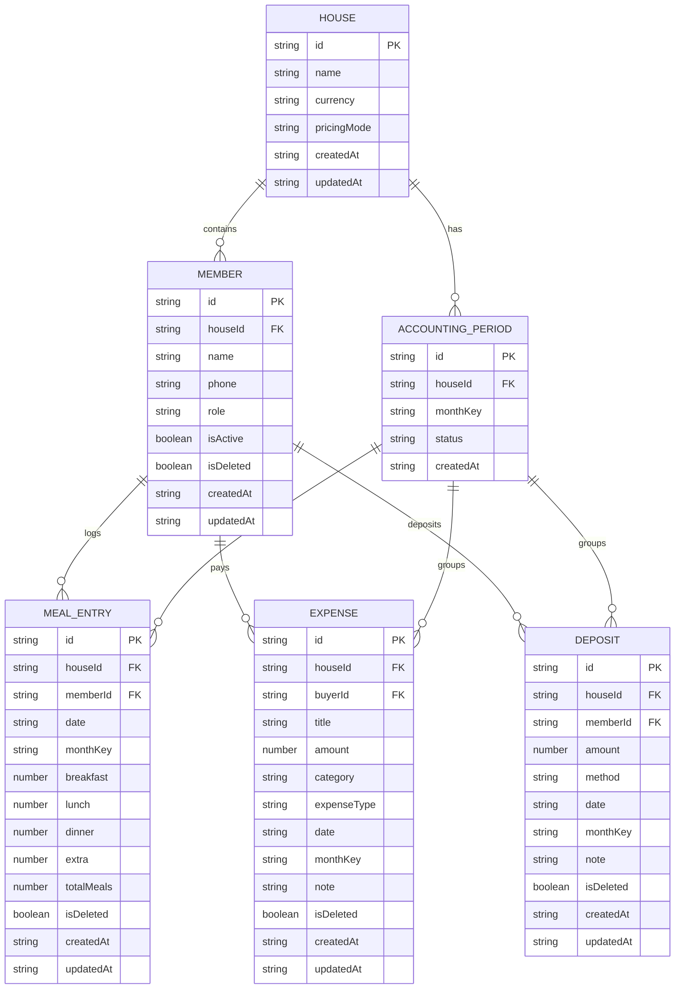

# Database Documentation & Schema Design

Database Technology: **IndexedDB via Dexie.js (Relational Local Database)**  
Database Name: `BachelorsMealManagerDB`  
Current Schema Version: `1`

---

## 1. Entity-Relationship Diagram

---

## 2. Table Schemas & Indexes

### Table: `houses`
- Primary Key: `id`
- Fields: `id, name, code, currency, pricingMode, fixedRate, createdAt, updatedAt`

### Table: `members`
- Primary Key: `id`
- Indexed Fields: `id, houseId, name, role, isActive, isDeleted, createdAt`

### Table: `accountingPeriods`
- Primary Key: `id`
- Indexed Fields: `id, houseId, monthKey, status`

### Table: `mealEntries`
- Primary Key: `id`
- Indexed Fields: `id, houseId, memberId, date, monthKey, [memberId+date], isDeleted`

### Table: `expenses`
- Primary Key: `id`
- Indexed Fields: `id, houseId, buyerId, category, expenseType, date, monthKey, isDeleted`

### Table: `deposits`
- Primary Key: `id`
- Indexed Fields: `id, houseId, memberId, method, date, monthKey, isDeleted`

---

## 3. Migration Strategy
Schema versioning is handled through Dexie's versioning API (`db.version(1).stores(...)`). Future versions (`db.version(2)`) specify non-destructive data transformations using `.upgrade(tx => ...)`.
