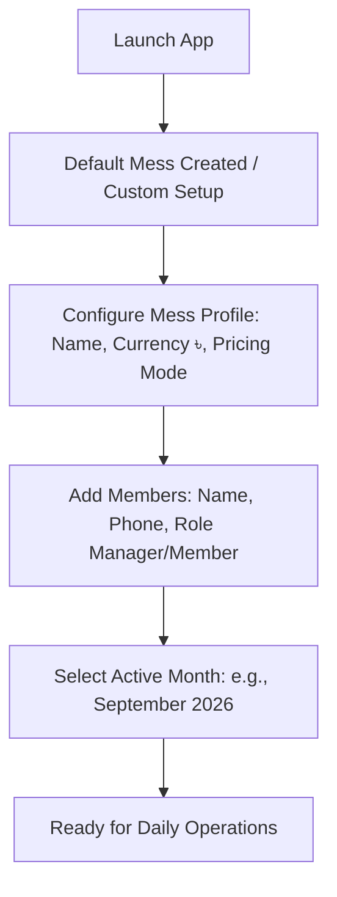
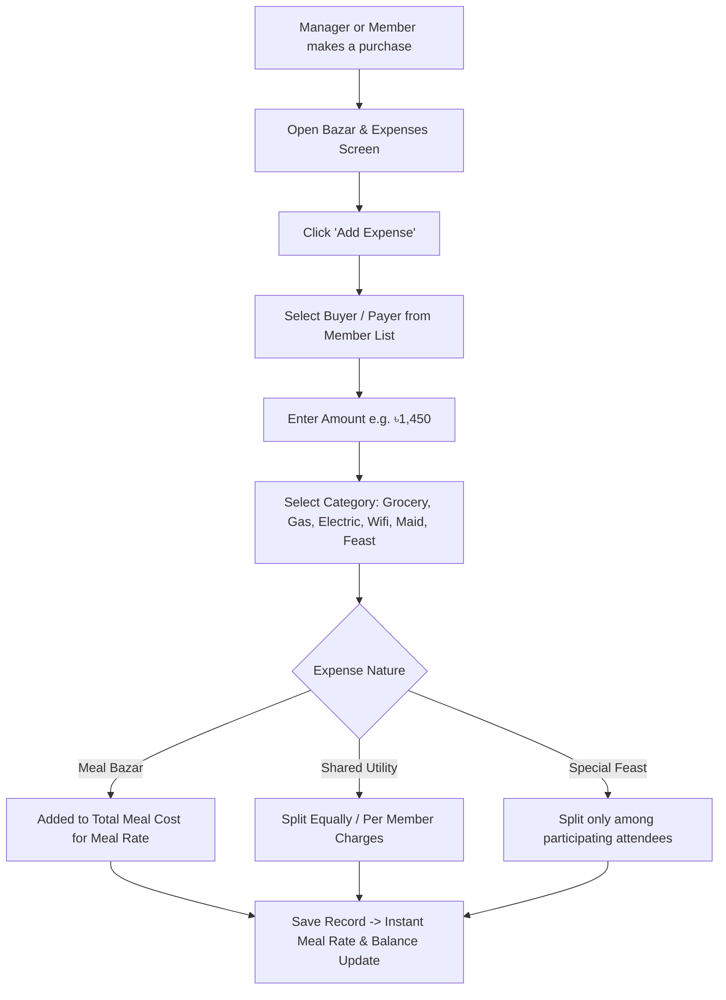
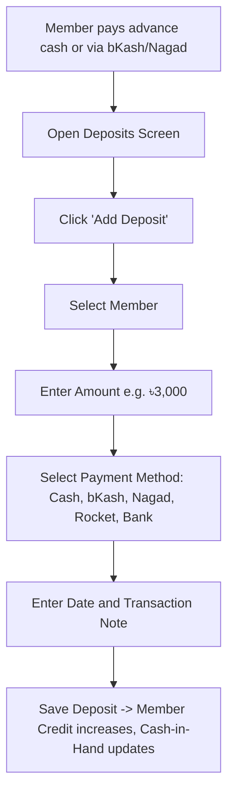
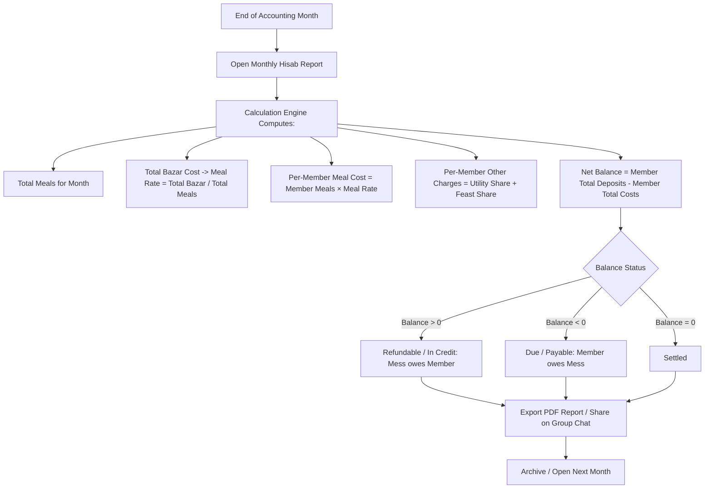
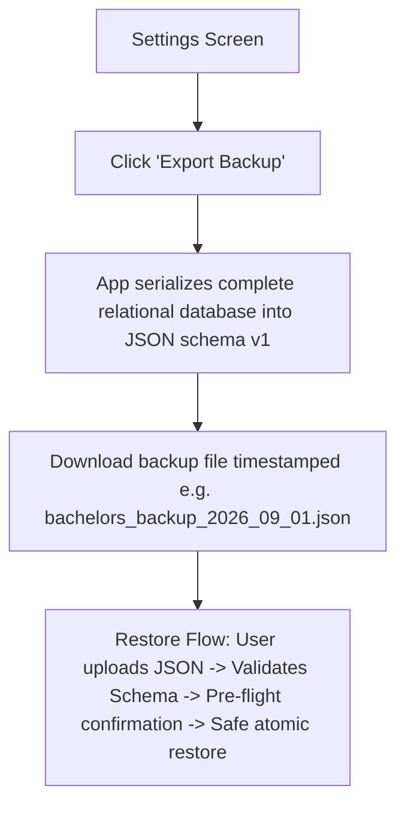

# Reference Workflows — Bachelors' Meal Manager

This document defines the primary user journeys and operational workflows identified from the reference application and real-world bachelor mess routines in Bangladesh and shared living households.

---

## 1. Initial Setup Workflow (New House / Mess)


---

## 2. Daily Meal Logging Workflow (The Core Routine)
```mermaid
graph TD
    A[Open App] --> B[Navigate to Meal Entry / Quick Log]
    B --> C[Select Target Date: Default Today]
    C --> D{Entry Method}
    D -->|Quick 1-Click| E[Apply 1 Meal to All Active Members]
    D -->|Copy Previous| F[Copy Previous Day's Counts]
    D -->|Custom Adjust| G[Adjust B/L/D Counters per Member (+/- 0.5 step)]
    E --> H[Verify Daily Sum]
    F --> H
    G --> H
    H --> I[Save Meal Entries -> Persistent DB & Live Recalculation]
```

---

## 3. Bazar / Grocery & Utility Expense Workflow


---

## 4. Member Deposit / Payment Collection Workflow


---

## 5. Month-End Settlement & Reconciliation (Hisab Day)


---

## 6. Data Protection & Backup Workflow

